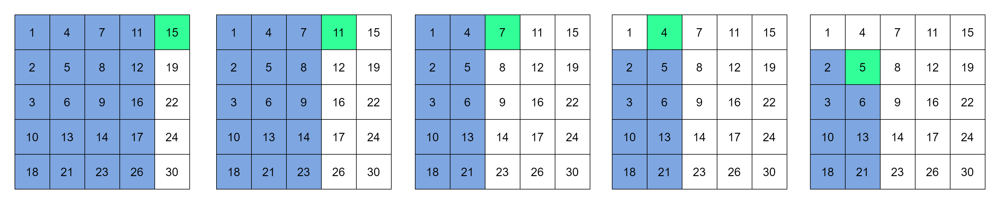

在一个 n * m 的二维数组中，每一行都按照从左到右递增的顺序排序，每一列都按照从上到下递增的顺序排序。请完成一个高效的函数，输入这样的一个二维数组和一个整数，判断数组中是否含有该整数。

```js
let arr = [
  [1,   4,  7, 11, 15],
  [2,   5,  8, 12, 19],
  [3,   6,  9, 16, 22],
  [10, 13, 14, 17, 24],
  [18, 21, 23, 26, 30]
]

var findNumberIn2DArray = function(matrix, target) {
    let find = false;
  if (matrix == null || target == null) {
    return find;
  }
  let rows = matrix.length;
  let columns = 0;
  if (rows > 0 && matrix[0] != null && matrix[0].length) {
    columns = matrix[0].length;
  }
  if (rows > 0 && columns > 0) {
    let row = 0;
    let column = columns - 1;
    // 选取的从右上角开始
    while (row < rows && columns >= 0) {
      if (matrix[row][column] == target) {
        return true;
      } else if (matrix[row][column] > target) {
        // 只能在左边区域找
        column--;
      } else {
        // 只能在下边区域找
        row++;
      }
    }
  }
  return find;
};
findNumberIn2DArray(arr,5)
```

思路：
1. 首先选取数组中右上角的数字，如果该数字等于要查找的数字，则查找过程结束；
2. 如果该数字大于要查找的数字，则剔除这个数字所在的列；
3. 如果该数字小于要查找的数字，则剔除这个数字所在的行；
4. 也就是说如果要查找的数字不在数组的右上角，则每一次都在数组的查找范围中剔除一行或一列，这样每一步都可以缩小查找的范围，直到找到要查找的数字或者查找范围为空
