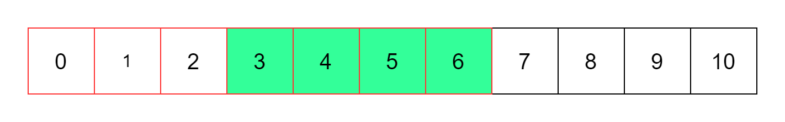

给定一个整数数组和一个整数 k ，请找到该数组中和为 k 的连续子数组的个数。
```js
var subarraySum = function (nums, k) {
  let sum = 0,
    ans = 0;
  let map = new Map();
  map.set(0, 1);
  for (let num of nums) {
    sum += num;
    if (map.has(sum - k)) {
      ans += map.get(sum - k);
    }
    if (map.has(sum)) map.set(sum, map.get(sum) + 1);
    else map.set(sum, 1);
  }
  return ans;
};
```

思路：前缀和，连续子数组的和即Sum6-Sum2