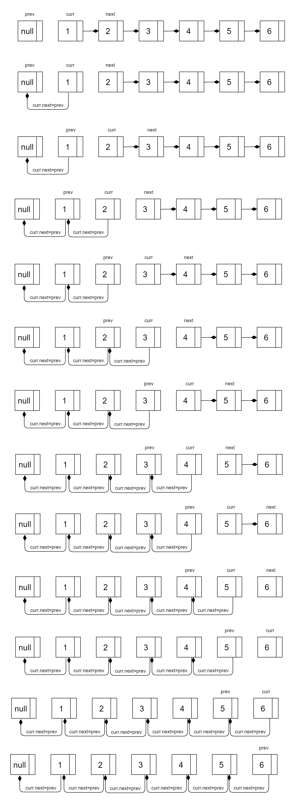

给你单链表的头节点 head ，请你反转链表，并返回反转后的链表。
```js
var reverseList = function(head) {
    let prev = null,curr = head;
    while(curr){
        let next = curr.next;
        curr.next = prev;
        prev = curr;
        curr = next;
    }
    return prev.next;
};
```
