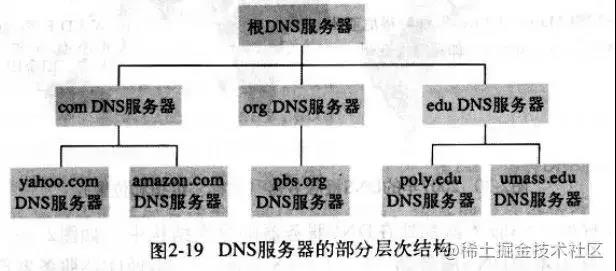
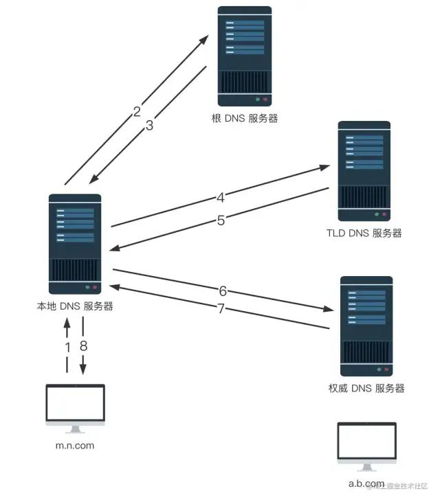
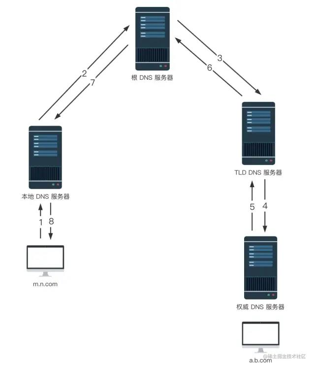

# 什么是 DNS
DNS 即域名系统，全称是 Domain Name System。当我们在浏览器输入一个 URL 地址时，浏览器要向这个 URL 的主机名对应的服务器发送请求，就得知道服务器的 IP，对于浏览器来说，DNS 的作用就是将主机名转换成 IP 地址。下面是摘自《计算机网络：自顶向下方法》的概念：

> DNS 是：
>- 一个由分层的 DNS 服务器实现的分布式数据库
>- 一个使得主机能够查询分布式数据库的应用层协议
也就是，DNS 是一个应用层协议，我们发送一个请求，其中包含我们要查询的主机名，它就会给我们返回这个主机名对应的 IP；

其次，DNS 是一个分布式数据库，整个 DNS 系统由分散在世界各地的很多台 DNS 服务器组成，每台 DNS 服务器上都保存了一些数据，这些数据可以让我们最终查到主机名对应的 IP。

**所以 DNS 的查询过程，说白了，就是去向这些 DNS 服务器询问，你知道这个主机名的 IP 是多少吗，不知道？那你知道去哪台 DNS 服务器上可以查到吗？直到查到我想要的 IP 为止。**

# 分布式、层次数据库
**什么是分布式？**
这个世界上没有一台 DNS 服务器拥有因特网上所有主机的映射，每台 DNS 只负责部分映射。

**什么是层次？**
DNS 服务器有 3 种类型：根 DNS 服务器、顶级域（Top-Level Domain, TLD）DNS 服务器和权威 DNS 服务器。它们的层次结构如下图所示：

- 根 DNS 服务器  

首先我们要明确根域名是什么，比如 www.baidu.com，有些同学可能会误以为 com 就是根域名，其实 com 是顶级域名，www.baidu.com 的完整写法是 www.baidu.com.，最后的这个 . 就是根域名。

根 DNS 服务器的作用是什么呢？就是管理它的下一级，也就是顶级域 DNS 服务器。通过询问根 DNS 服务器，我们可以知道一个主机名对应的顶级域 DNS 服务器的 IP 是多少，从而继续向顶级域 DNS 服务器发起查询请求。

- 顶级域 DNS 服务器  

除了前面提到的 com 是顶级域名，常见的顶级域名还有 cn、org、edu 等。顶级域 DNS 服务器，也就是 TLD，提供了它的下一级，也就是权威 DNS 服务器的 IP 地址。

- 权威 DNS 服务器  

权威 DNS 服务器可以返回主机 - IP 的最终映射。

关于这几个层次的服务器之间是怎么交互的，接下来我们会讲到 DNS 具体的查询过程，结合查询过程，大家就不难理解它们之间的关系了。

# 本地 DNS 服务器
之前对 DNS 有过了解的同学可能会发现，上一节的 DNS 层次结构，为什么没有提到本地 DNS 服务器？因为**严格来说，本地 DNS 服务器并不属于 DNS 的层次结构**，但它对 DNS 层次结构是至关重要的。那什么是本地 DNS 服务器呢？

每个 ISP 都有一台本地 DNS 服务器，比如一个居民区的 ISP、一个大学的 ISP、一个机构的 ISP，都有一台或多台本地 DNS 服务器。当主机发出 DNS 请求时，该请求被发往本地 DNS 服务器，本地 DNS 服务器起着代理的作用，并负责将该请求转发到 DNS 服务器层次结构中。

接下来就让我们通过一个简单的例子，看看 DNS 的查询过程是怎样的，看看客户端、本地 DNS 服务器、DNS 服务器层次结构之间是如何交互的。

# 递归查询、迭代查询
如下图，假设主机 m.n.com 想要获取主机 a.b.com 的 IP 地址，会经过以下几个步骤：

1. 首先，主机 m.n.com 向它的本地 DNS 服务器发送一个 DNS 查询报文，其中包含期待被转换的主机名 a.b.com；

2. 本地 DNS 服务器将该报文转发到根 DNS 服务器；

3. 该根 DNS 服务器注意到 com 前缀，便向本地 DNS 服务器返回 com 对应的顶级域 DNS 服务器（TLD）的 IP 地址列表。
意思就是，我不知道 a.b.com 的 IP，不过这些 TLD 服务器可能知道，你去问他们吧；

4. 本地 DNS 服务器则向其中一台 TLD 服务器发送查询报文；

5. 该 TLD 服务器注意到 b.com 前缀，便向本地 DNS 服务器返回权威 DNS 服务器的 IP 地址。
意思就是，我不知道 a.b.com 的 IP，不过这些权威服务器可能知道，你去问他们吧；

6. 本地 DNS 服务器又向其中一台权威服务器发送查询报文；

7. 终于，该权威服务器返回了 a.b.com 的 IP 地址；

8. 本地 DNS 服务器将 a.b.com 跟 IP 地址的映射返回给主机 m.n.com，m.n.com 就可以用该 IP 向 a.b.com 发送请求啦。

“你说了这么多，递归呢？迭代呢？”

这位同学不要捉急，其实递归和迭代已经包含在上述过程里了。

主机 m.n.com 向本地 DNS 服务器 dns.n.com 发出的查询就是递归查询，这个查询是主机 m.n.com 以自己的名义向本地 DNS 服务器请求想要的 IP 映射，并且本地 DNS 服务器直接返回映射结果给到主机。

而后继的三个查询是迭代查询，包括本地 DNS 服务器向根 DNS 服务器发送查询请求、本地 DNS 服务器向 TLD 服务器发送查询请求、本地 DNS 服务器向权威 DNS 服务器发送查询请求，所有的请求都是由本地 DNS 服务器发出，所有的响应都是直接返回给本地 DNS 服务器。

那么问题来了，所有的 DNS 查询都必须遵循这种递归 + 迭代的模式吗？

当然不是。

从理论上讲，任何 DNS 查询既可以是递归的，也可以是迭代的。下图的所有查询就都是递归的，不包含迭代。

看到这里，大家可能会有个疑问，TLD 一定知道权威 DNS 服务器的 IP 地址吗？

emmm...

还真不一定，有时 TLD 只是知道中间的某个 DNS 服务器，再由这个中间 DNS 服务器去找到权威 DNS 服务器。这种时候，整个查询过程就需要更多的 DNS 报文。

# DNS 缓存
为了让我们更快的拿到想要的 IP，DNS 广泛使用了缓存技术。DNS 缓存的原理非常简单，在一个 DNS 查询的过程中，当某一台 DNS 服务器接收到一个 DNS 应答（例如，包含某主机名到 IP 地址的映射）时，它就能够将映射缓存到本地，下次查询就可以直接用缓存里的内容。当然，缓存并不是永久的，每一条映射记录都有一个对应的生存时间，一旦过了生存时间，这条记录就应该从缓存移出。

事实上，有了缓存，大多数 DNS 查询都绕过了根 DNS 服务器，需要向根 DNS 服务器发起查询的请求很少。