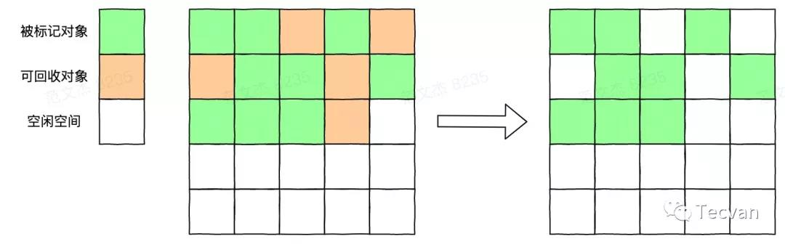
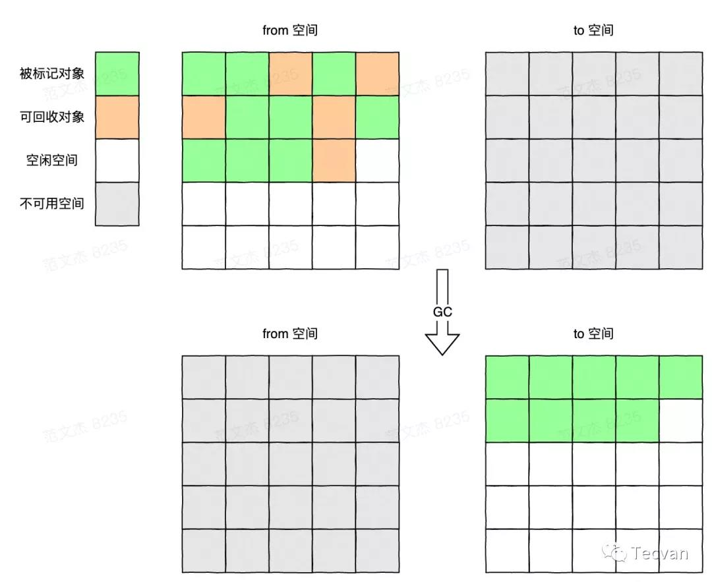
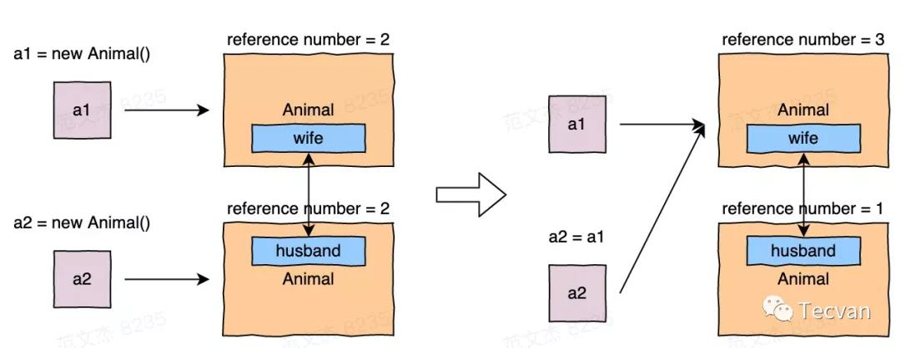
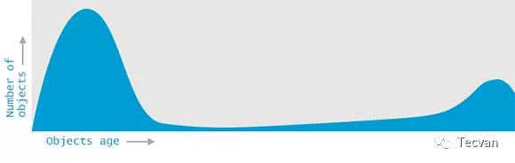

# 自动垃圾回收算法

随着时间的演进，垃圾回收算法也在不断地完善，说是完善其实不算准确，应该说是根据不同的需求而有了不同的取舍，从而产生了不同的算法。其实不论哪个垃圾回收算法，都有一套共同的流程：
1. 标记内存空间中的活动对象（在使用中的对象）和非活动对象（可以回收的对象）。
2. 删除非活动对象，释放内存空间。
3. 整理内存空间，避免频繁回收后产生的大量内存碎片（不连续内存空间）。

## 标记-清除法
标记-清除法由 John McCarthy 于 1960 年发表的一篇论文提出，其主要分两个阶段：

1. 第一阶段是标记，从一个 GC root 集合出发，沿着「指针」找到所有对象，将其标记为活动对象。
2. 第二阶段是清除，将内存中未被标记的对象删除，释放内存空间。

从上面的描述来看，标记-清除算法可以说是非常简单的，现在的各类垃圾回收算法也都是它的思想的延续。

虽然简单，但其也有着很明显的缺点，即在多次回收操作后，会产生大量的内存碎片，由于算法没有再整理内存空间，内存空间将变得很碎，此时如果需要申请一个较大的内存空间，即使剩余内存总大小足够，也很容易因为没有足够的连续内存而分配失败。

## 复制算法
为了解决以上问题，Marvin L. Minsky 在 1963 年提出了著名的 「复制算法」 ：

1. 将整个空间平均分成 from 和 to 两部分。
2. 先在 from 空间进行内存分配，当空间被占满时，标记活动对象，并将其复制到 to 空间。
3. 复制完成后，将 from 和 to 空间互换。

由于直接将活动对象复制到另一半空间，没有了清除阶段的开销，所以能在较短时间内完成回收操作，并且每次复制的时候，对象都会集中到一起，相当于同时做了整理操作，避免了内存碎片的产生。

虽然复制算法有吞吐量高、没有碎片的优点，但其缺点也非常明显。首先，复制操作也是需要时间成本的，若堆空间很大且活动对象很多，则每次清理时间会很久。其次，将空间二等分的操作，让可用的内存空间直接减少了一半。

## 引用计数
该算法由 George E. Collins 于 1960 年提出，主要操作为：

1. 实时统计指向对象的引用数（指针数量）。
2. 当引用数为 0 时，实时回收对象。

该算法可以即时回收垃圾数据，对程序的影响时间很短，效率很高。高性能、实时回收，看似完美的方案其实也有个问题，当对象中存在循环引用时，由于引用数不会降到 0，所以对象不会被回收。

上面三大算法的出现，基本奠定了垃圾回收的根本性内容，后续出现的垃圾回收算法，基本都是基于上面三个算法的取舍和组合。

## 标记-压缩算法
该算法于 1970 年出现，其结合了标记-清除法和复制算法的优点，主要操作如下：

1. 从一个 GC root 集合出发，标记所有活动对象。
2. 将所有活动对象移到内存的一端，集中到一起。
3. 直接清理掉边界以外的内存，释放连续空间。

可以发现，该算法既避免了标记-清除法产生内存碎片的问题，又避免了复制算法导致可用内存空间减少的问题。当然，该算法也不是没有缺点的，由于其清除和整理的操作很麻烦，甚至需要对整个堆做多次搜索，故而堆越大，耗时越多。

## 代际假设和分代收集
经过调查发现，大多数应用程序内的数据有以下两个特点：

- 大多数对象的生命周期很短，很快就不再被需要了
- 那些一直存活的对象通常会存在很久

简单讲就是对象的生存时间有点两极化的情况：

所以可以将对象进行分代，从而对不同分代实施不同的垃圾回收算法，以达到更高的效率

# JavaScript 垃圾回收
JavaScript 的原始数据类型存在栈中，引用数据类型存在堆中，所以讨论 JavaScript 的垃圾回收即讨论其栈中数据的回收以及堆中数据的回收。

## 栈中垃圾回收
> ESP(Extended Stack Pointer): 扩展栈指针寄存器，用于存放函数栈顶指针。

JavaScript 在执行函数时，会将其上下文压入栈中，ESP 上移，而当函数执行完成后，其执行上下文可以销毁了，此时仅需将 ESP下移到下一个函数执行上下文即可，当下一个函数入栈时，会将 ESP 以上的空间直接覆盖。

所以 JavaScript 引擎是通过下移 ESP 来完成栈的垃圾回收的。

## 堆中垃圾回收
不同于栈中的垃圾回收，堆中的垃圾数据回收需要用到 JavaScript 的垃圾回收器。

JavaScript 堆中垃圾数据回收就使用到了分代收集的思想，引擎将堆空间分为 「新生代(young-space)」 和 「老生代(old-space)」 ，并且对两个区域实施不同的垃圾回收策略。

「新生代：」 新生代用于存放生存时间短的对象，大多数新创建的小的对象都会被分配到该区域，该区域的垃圾回收会比较频繁。

在新生代中，引擎使用 Scavenge 算法(https://v8.dev/blog/trash-talk) 进行垃圾回收，即上面提到的复制算法。

其将新生代空间对半分为 from-space 和 to-space 两个区域。新创建的对象都被存放到 from-space，当空间快被写满时触发垃圾回收。先对 from-space 中的对象进行标记，完成后将标记对象复制到 to-space 的一端，然后将两个区域角色反转，就完成了回收操作。

由于每次执行清理操作都需要复制对象，而复制对象需要时间成本，所以新生代空间会设置得比较小（1~8M）。

「老生代：」 老生代被用于存放生存时间长的对象和大的对象：

- 即一些大的对象会被直接分配到老生代空间
- 新生代中经过两次垃圾回收后仍然存活的对象，会晋升到老生代空间

引擎在该空间主要使用上面提到的 「标记-压缩算法」 。首先对活动对象进行标记，标记完成后，将所有存活对象移到内存的一段，然后清理掉边界外的内存。

由于 JavaScript 是单线程运行的，意味着垃圾回收算法和脚本任务在同一线程内运行，在执行垃圾回收逻辑时，后续的脚本任务需要等垃圾回收完成后才能继续执行。若堆中的数据量非常大，一次完整垃圾回收的时间会非常长，将导致应用的性能和响应能力都直线下降。

为了避免垃圾回收影响应用的性能，V8 将标记的过程拆分成多个子标记，让垃圾回收标记和应用逻辑交替执行，避免脚本任务等待较长时间。