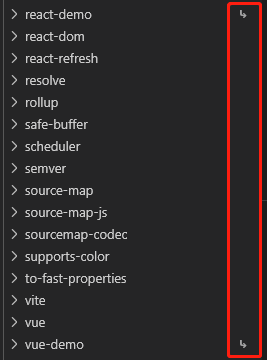

# Yarn Workspaces

### 启用Workspace
==package.json== 设置
```json
"name": "project-name",
"version": "1.0.0",
"private": true,//确保根目录不被发布出去,并非所有内容都需要发布到npm
"workspaces": [//多包的路径，通常使用正则匹配packages下所有文件夹
    "packages/*"
],
```

### 项目目录
```
app/
|--packages/
|  |--app1/
|  |  |--package.json
|  |--app2/
|  |  |--package.json
|--package.json
```

### 在某个项目中运行命令  
> yarn workspace <workspace_name> <command>

```sh
# 为app1安装react
yarn workspace app1 add react
# 为app2安装vue
yarn workspace app2 add vue
# 启动app1
yarn workspace app1 run start
# 启动app2
yarn workspace app2 run serve
```

### 在根目录安装依赖
> yarn <add|remove> <package> -W

```sh
# 在根目录安装react
yarn add axios -W
```

### packages项目包的使用
通常packages中，某些项目会依赖另外一些项目，比如vue3的源码，接下来创建一个monorepo项目

```sh
# 1初始化项目
yarn init -y
# 2创建目录
mkdir packages
# 3编写workspace
"workspaces":[
    "packages/*"
],
# 4建项目
cd packages
yarn create vite vue-demo --template vue
yarn create vite react-demo --template react
# 5安装依赖
cd ../
yarn
# 6打开项目
yarn workspace vue-demo run dev
yarn workspace react-demo run dev
```
一个多包项目其实就建立好了，那共同的依赖又如何使用呢
```sh
cd packages
mkdir utils
yarn init -y
mkdir index.js
```
编写index.js,随便写点什么
```js
export default function test() {
    console.log('test')
}
```
当前项目目录
```
app/
|--packages/
|  |--vue-demo/
|  |  |--package.json
|  |--react-demo/
|  |  |--package.json
|  |--utils/
|  |  |--package.json
|--package.json
```
```sh
yarn workspace vue-demo add utils@1.0.0
yarn workspace react-demo add utils@1.0.0
```
就像安装npm包一样使用packages里的包

### 引用规则
首先，当前monorepo项目中，所有packages下的项目都会以软链(超链接，快捷方式)的方式存在于node_modules中，如下图：  
  
- 安装npm包时，在monorepo 中，是否vue-demo所需版本的 utils；
- 若存在，执行 link 操作，vue-demo将使用本地utils；
- 若不存在，从远端 npm 仓库拉取utils使用；

### 查看当前依赖关系
yarn workspaces info --json
```json
{
  "react-demo": {
    "location": "packages/react-demo",
    "workspaceDependencies": [
      "@memo/utils"
    ],
    "mismatchedWorkspaceDependencies": []
  },
  "@memo/utils": {
    "location": "packages/utils",
    "workspaceDependencies": [],
    "mismatchedWorkspaceDependencies": []
  },
  "vue-demo": {
    "location": "packages/vue-demo",
    "workspaceDependencies": [
      "@memo/utils"
    ],
    "mismatchedWorkspaceDependencies": []
  }
}
```
